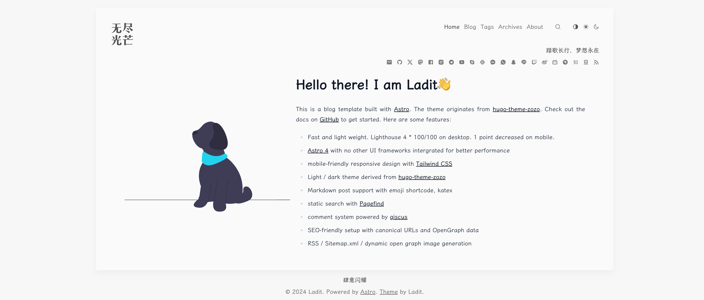

# [Astro](https://astro.build) Blog Template

An opinionated and neat blog template built with [Astro](https://astro.build). The theme originates from [hugo-theme-zozo](https://github.com/varkai/hugo-theme-zozo). Check out the ✨ [Live Demo](https://astro-blog-zozo.pages.dev/) ✨.




## Features

- Fast and light weight. Lighthouse 4 \* 100/100 on desktop. 1 point decreased on mobile.
- [Astro 4](https://astro.build)
- No other UI frameworks intergrated for better performance
- mobile-friendly responsive design with [Tailwind CSS](https://tailwindcss.com/)
- Light / dark theme derived from [hugo-theme-zozo](https://github.com/varkai/hugo-theme-zozo)
- Markdown post support with emoji shortcode, katex
- static search with [Pagefind](https://pagefind.app)
- comment system powered by [giscus](https://github.com/giscus/giscus)
- SEO-friendly setup with canonical URLs and OpenGraph data
- RSS generation
- Sitemap.xml generation
- dynamic open graph image generation

## Getting Started

```shell
# let bun to create a local repo using this template
bun create ladit/astro-blog-zozo
```

### populate your content

To craft your own site further, check the folders below and modify anything as you wish. Markdown post with frontmatter is supported.

```
public # favicons here
├── apple-touch-icon.png
├── favicon.ico
src
├── assets
│   ├── logo.svg # site logo
├── config.ts # main config
├── content # markdown posts and attachments go here
│   ├── attachments
│   └── posts
├── pages
│   ├── index.astro # index page written in Astro component
│   └── about.astro # about page written in Astro component
.giscus.json
```

All frontmatter fields except title are optional. Date field is under ISO 8601 format without quotation marks.
The posts frontmatter describes as:

```yaml
---
slug: my-custom-slug
title: My awesome title
description: some desc
image: ../attachments/100.jpg # hero & social image
date: 2024-02-26T23:30:47+08:00
lastmod: 2024-02-26T23:30:47+08:00
hidden: false # set this to true to make this post hidden from posts list. But the uri is still accessable.
tags:
  - demo
  - theme
hide: # set a element list to hide in the post page
  - title
  - date
  - lastmod
  - tags
  - readingTime
  - toc
  - comments
---
```

Note:

> To use the Astro `Content Collection` feature, the site content must be placed at `src/content`.

### comments

Post comments is powered by [giscus](https://github.com/giscus/giscus). Follow instructions [here](https://giscus.app/) to initialize your Github repo, install giscus app, enable discussion and get your parameters to fill in `src/config.ts: GiscusConfig`.

Modify `.giscus.json` to restrict the domains that can load giscus with your repository's discussions. Document is [here](https://github.com/giscus/giscus/blob/main/ADVANCED-USAGE.md).

## Todo

- `@shikijs/transformers` require custom style
- svg can not be embeded in open graph image. Maybe a satori bug.
- i18n

## Contribute

Issues and PRs are welcome!

## License

[MIT](./LICENSE)

## Acknowledgements

- [varkai/hugo-theme-zozo](https://github.com/varkai/hugo-theme-zozo)
- [Charca/astro-blog-template](https://github.com/Charca/astro-blog-template)
- [satnaing/astro-paper](https://github.com/satnaing/astro-paper)
- [ricora/alg.tus-ricora.com](https://github.com/ricora/alg.tus-ricora.com)
- [one-aalam/astro-ink](https://github.com/one-aalam/astro-ink)
